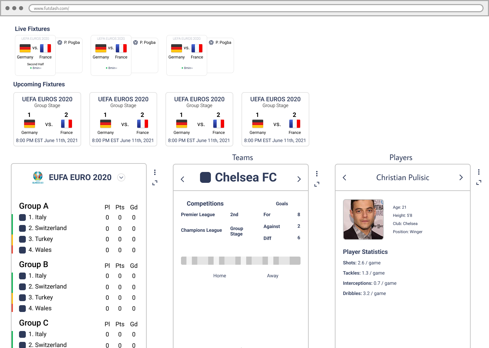

[Dashboard.football](https://gifted-thompson-b218f4.netlify.app/) is a dashboard web application that will allows users to keep track of
multiple soccer competitions that they follow in one place.

**This is an ongoing project. Check back for future updates!**

# An Avid Football Fan's Testimony
## (Sorry, this ⚽ kind of football, not this 🏈 )

> **Disclaimer** I will be referring to what most North Americans call *soccer* as football, because
1. It actually makes sense as a name.
2. Literally everyone else in the world calls it football.
3. I'll also just use the emoji to avoid confusion.

I've been following professsional football leagues since I started college. I played alot of ⚽ as a kid and I
wanted to reconnect with my love for the sport. I started following the Premier League and Bundesliga and watching
the occasional game.

Fast forward years later, I'm now a self proclaimed football fan, following all of the top leagues in Europe with at
minimum passing interest. Point to any player on the TV screen and I could probably give you an informed opinion of that player.

# A World of Frustrating Solutions 🤦

Little did I know that following the sport I love would be a frustrating endeavor.

There's already the problem of streaming rights being owned by different broadcasters, forcing avid fans to subscribe and pay for multiple services
to get coverage on games from different leagues, a somewhat unavoidable solution.

But simply finding a space where I could find information about all the leagues/competitions, matches, teams and players that I'm interested in following
is a struggle, one that I haven't found an ideal solution for.

I signed up for countless sports score/sports content websites that were intended to fulfill this need, but could never find a solution that stuck. They
all seemed that have drawbacks that prevented me from fully adopting them.

# Competitive Analysis
To gather a more complete picture of why these solutions weren't working, I gathered screenshots and analyzed the top websites that would come up when
someone searches "soccer scores" on Google, breaking down what each solution did well and why they might fall short of being adopted by a user like me.

View the complete analysis notes [here](https://draconia.notion.site/6aa100f974804544af28f9ab1400473f?v=f600cfb8bbd64ad7943315e77b6707e9).

After synthesizing this analysis I found 3 key factors that might prevent adoption of their platform.

---

## 1. Lack of Personalization

None of the solutions I tried had an onboarding experience that asked me what I was interested in following, which seemed odd considering how different
each users interest could be.

Platforms would simply show all the available information at once, with some having limited personalization features like
a Favorites section.

LiveScore.com for example has a dedicated Favorites section, but its limited to individual matches and competitions. But favoriting doesn't really increase
usability. It simply provides quick links to the same content as if you had searched up the league or match in the search function.

Soccer24 has a Favorites feature too but only for Teams and Leagues.

---

## 2. Too much Content Pushing Leads to Cognitive Load

The websites hoping to cater to all sports fans like Fox Sports and ESPN do this consistently more than the others, understandably so. They're hoping that
since you might be a general sports fan, you might be interested in any and all sports content, so they show users flashy and big content cards like the ones on the
Fox Sports home page, hoping to grab you're attention.

Even if you **explicitly** choose the Premier League ⚽ as your favorite competition, you might assume that only content relevant to this competition would be shown,
but thats not the case. The website still show you content for sports you don't follow.

This choice always puzzled me. The platform explicitly asks for the user's preference, but then chooses to ignore them the majority of the time.

Websites dedicated to ⚽ scores and ⚽ content only are better with this for obvious reasons, but they also tend to shove too much information and content
onto the page.

Sites like LiveScore and Soccer24 do a decent job of prioritizing user favorited content, but still shows information for leagues the user may not be interested
in, often times too much of it too.

Their home pages end up scrolling really far down as they show you every match for every conceivable league that day. It's unnecessary and most likely
not of interest any user.

<LightboxImage
  images={[
    {
      title: "livescore_home.png",
      caption: "LiveScore Home page"
    },
    {
      title: "soccer24_home.png",
      caption: "Soccer24 Home page"
    }
  ]}
/>

### Where's the information I actually want?
Some examples of what you might consistently expect to see might be the upcoming matches for your favorites and the latest results for your favorites,
which you will find only appears sometimes depending on the website.

ESPN's home shows you upcoming matches, but no recent match results.

Fox Sports home shows the exact opposite; recent match recents, but no upcoming match details.

---

## 3. Clunky UI and UX

Aesthetically the Fox Sports website and Livescore website seem the most up to date with current trends, emphasizing a minimal design language with ample padding
and white space, but usability is hampered by lackluster personalization options.

<LightboxImage
  images={[
    {
      title: "fox_home.png",
      caption: "Fox Sports Home page"
    },
    {
      title: "livescore_home.png",
      caption: "LiveScore Home page"
    }
  ]}
/>

Other websites like WhoScored and Soccer24 offer a wealth of impressive information, but oudated, clunky UIs and a confusing content organization makes the website less approachable.

<LightboxImage
  images={[
    {
      title: "whoscored_home.png",
      caption: "WhoScored Home page"
    },
    {
      title: "soccer24_home.png",
      caption: "Soccer24 Home page"
    }
  ]}
/>

# A Vision of a one stop Dashboard

Unsatisfied with the current existing solutions, I set out ambitiously to build my own. To avoid the pitfuls of these solutions, I started writing down some guidelines
to aid me along the process. They will help me maintain focus and ensure I actually solve for the issues I encountered previously.

## Uncompromising Personalization

- Whether its the 3rd tier of the Belgium football league or the ever popular British Premier League, users should be able to see information about these matches in one place.
- Users should be able to follow their favorite leagues, teams, and players with ease.

## Content only when Appropriate

- A true home page should include content from a user's favorites and **only** their favorites.
- If I'm on a page for a specific league, I should only see news content for that league.

> **I will know that my solution is successful when these guidelines are met. These guidelines will also continue to evolve and mature as I interate through designs and production builds.**

---

# Iteration 1

My initial design categorized information that a user follows based on 3 types: players, leagues, and teams. Users would expand and minimize the columns
based on what they wanted to see. Upcoming and Live match information would be shown at the top as cards, if available.

<LightboxImage
  images={[
    {
      title: "competitionspage_league.png",
      caption: "Competitions Page for League"
    },
    {
      title: "competitionspage_groupstage.png",
      caption: "Competitions Page for Cup"
    }
  ]}
/>

I then created an initial version of the competitions page for leagues and cups. This would be one of the most popular pages of my application, so I decided to start production
of this page as an initial MVP where users can see match and standings information. This would allow me to test out the data API I'm working with, [API-Football](https://www.api-football.com/)
and acertain any development limitations.

To see the initial alpha build of this application, click [here](https://gifted-thompson-b218f4.netlify.app/).

# Currently Under Development
- Individual match page
- Bug fixes for live match updating
- Cup competition bracket page

Here are the most recent designs for the individual match page that is yet to be developed.
<LightboxImage
  images={[
    {
      title: "fixturepage_horizontal.png",
      caption: "Match Page with horizontal timeline"
    },
    {
      title: "fixturepage_vertical.png",
      caption: "Match page with vertical timeline"
    }
  ]}
/>

