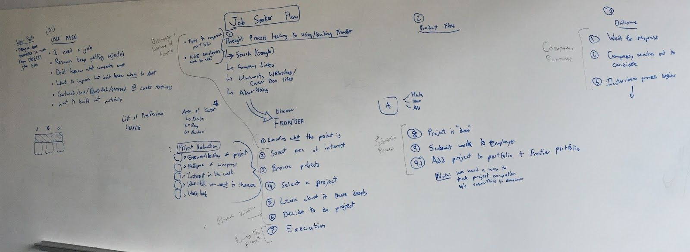
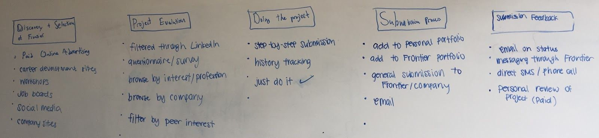
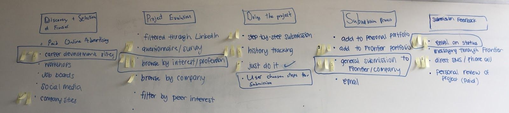
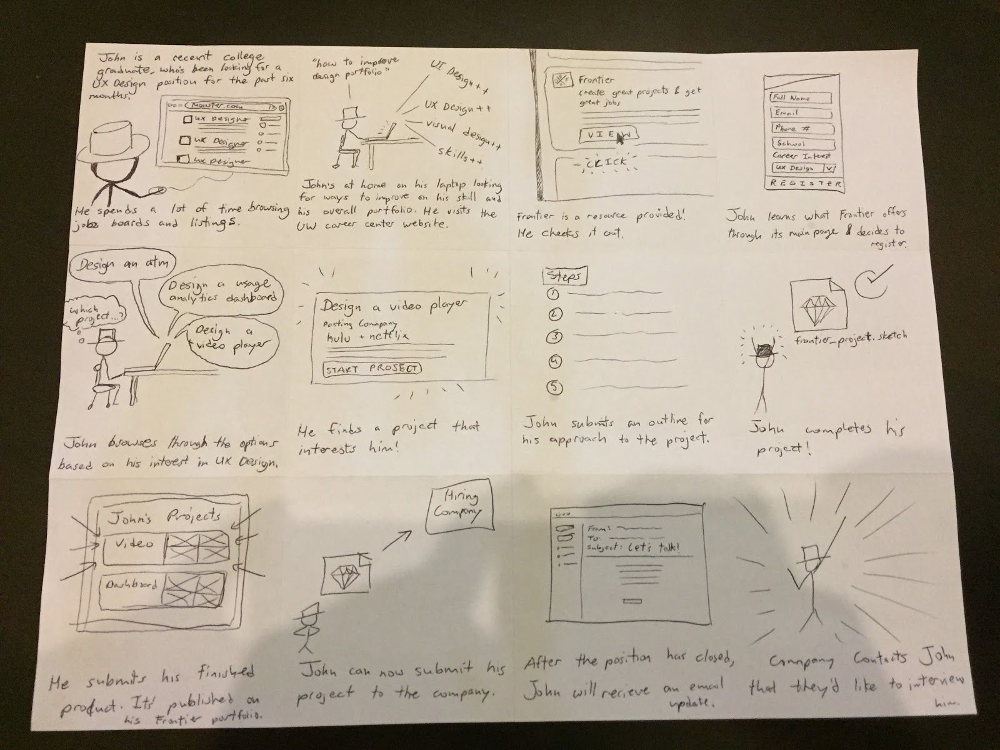
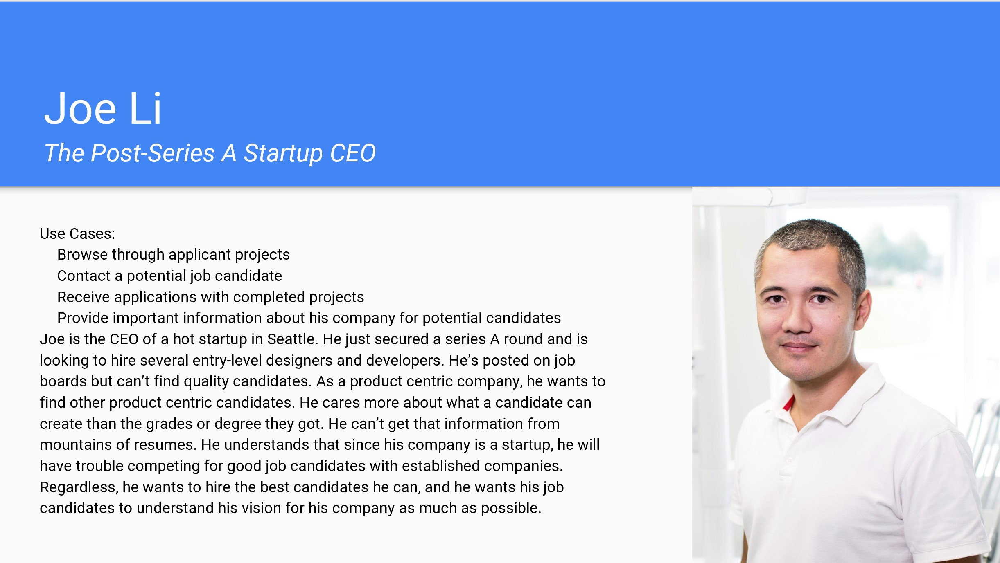
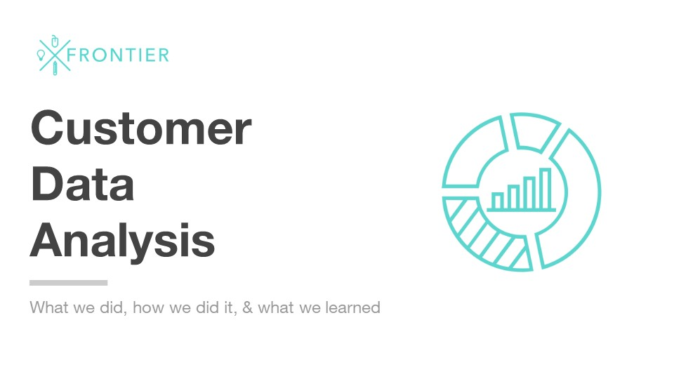

INFO 498 - UX Design Studio Course Project

To see a clickable prototype of this web platform, click [here](https://projects.invisionapp.com/share/4TBW3F5RK#/screens)

## The Design Process

From the start, our professor wanted our class to act as a design studio, and for us to pursue design projects that we were interested in working on. The success of our projects were dependent on the usability and user experience of our final designs. We ideated as a class and then voted on the best ideas that we would want to design for, forming small teams in the process.

Our team decided that we wanted to design a platform that would facilitate aspiring designers/developers/project managers to advance their skills and careers by giving them projects to work on directly on the platform. Once they complete a project, they can display their work directly on the platform. The project specifications themselves are created in collaboration with companies looking to hire. This model would allow for aspiring job candidates to showcase their skills and capabilities whilst allowing companies to handpick the type of skills they want to see in a potential candidate.

Our idea gained traction with our professor and our peers, but we needed to gain a better understanding of what our user flow and potential users would look like. We created customer journey maps and storyboards to showcase our understanding of how our product would function to our professor and peers.

  

  

  

  

  

  

  

  

We then created user personas to further showcase our potential users and what they would look like. We wanted to get an understanding of the specific pain points our users are facing to establish an idea of how our platform would be addressing these difficulties.

  

  

  

  

  

  

  

  

  

  

  

  

Then, we built and distributed a customer survey and performed user interviews to confirm our audience definition. We asked them questions concerning their struggles showcasing their skills and abilities to potential employers, what kind of work they were willing to do to showcase these skills, and other concerns they had in regards to the job hunting process.

We also drew up some low fidelity mock ups of our platform to do some user testing with some potential users to see how our user flow would perform in action.

After our results came in, we performed analysis on these results and presented the viability of our product to our professor and peers.

After a successful presentation, we began working on a higher fidelity version of our wireframes for user testing, and eventually ended up with the final prototype that you can find here. We sent this prototype alongside specific instructions for the testers to usertesting.com.

