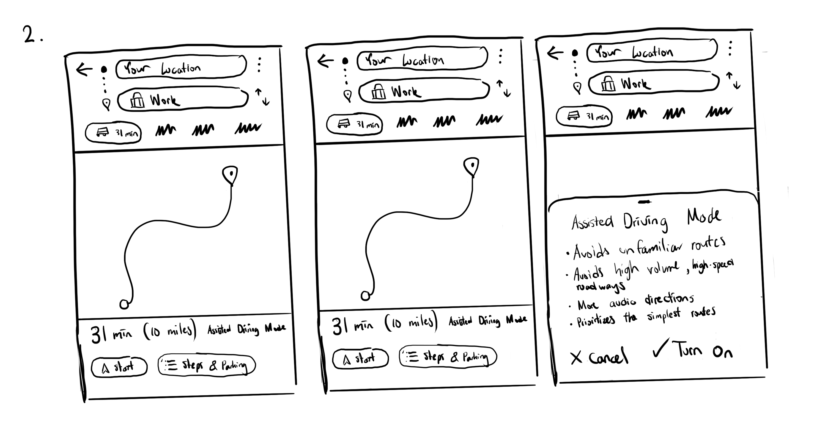
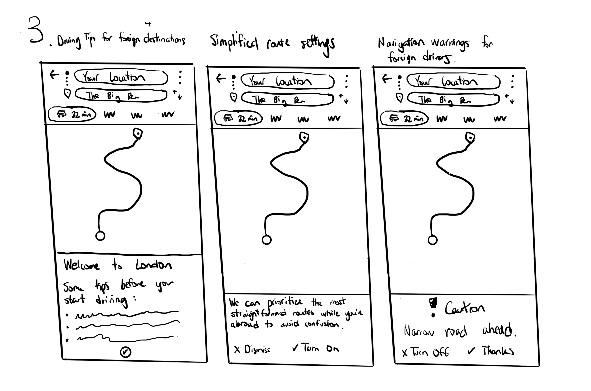
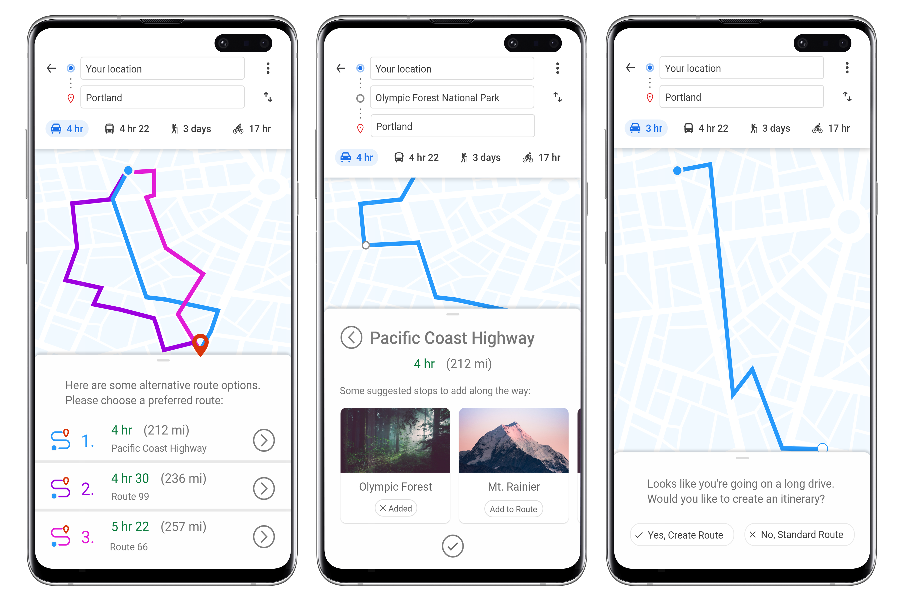
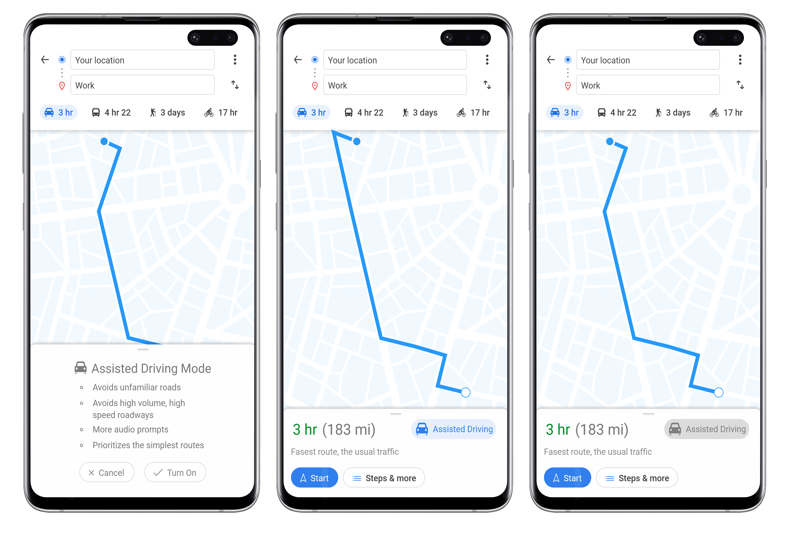
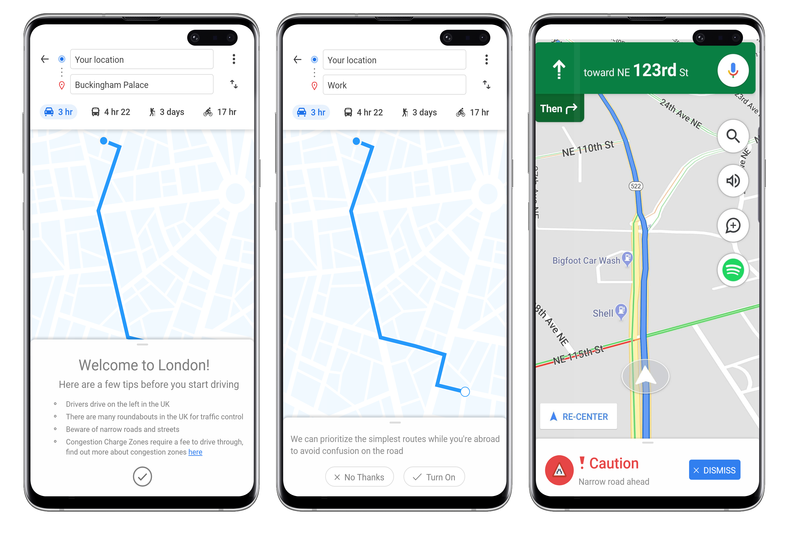

# When it comes to Navigation, Google is King 👑

Google Maps has remained the go-to service that users trust to get them where they need to go for more than a decade. With more than [1 billion active users](https://www.theverge.com/2017/5/17/15654454/android-reaches-2-billion-monthly-active-users) and counting, it far overshadows its competition.

## Endless Data, Powerful AI

Utilizing a [wealth of data available to them](https://www.blog.google/products/maps/google-maps-101-how-we-map-world/) to power their navigation experience, google is able to calculate the **fastest route possible**. They also have the ability to account for live traffic and live traffic speeds when that data is provided to them from their users, further optimizing the calculated fastest route.

## A User Experience built for our Fast-Paced, Modern World

Google designed this navigation experience with speed and efficiency in mind; not only is it super quick and easy to to start navigating, google utilizes all of the data available to them to get you where you need to go as fast as possible.

Step 1: Search for Destination

Step 2: Confirm and Start Navigation

Step 3: Follow and Drive

## Time is Money

This navigation experience can clearly be beneficial to just about anyone. For all we know, that extra five minutes Google Maps digs up by optimizing your route has saved countless people from missing that all-important interview or that career defining presentation with the CEO.

Gone are the days when drivers had to spend time examining a map manually when they're driving somewhere new, jotting down directions and routes just to get from A to B. All you have to do is follow the directions given to you by the navigator.

# Speed isn't Everything

There are undoubtedly many positive gains that users have when using google maps, but questions should be asked about how the navigation algorithm and app is designed to prioritize speed.

Photo by Christian Englmeier on Unsplash

This design choice presents a clear value to the user and incentivize users to use their product, but the application's focus on speed leads to neglect for many other user scenarios in which Google Maps could potentially be beneficial to a user.

At best, Google Maps' potential is being wasted.

At worst, their design choice is a poor reflection of human needs.

If you consider individual drivers, every driver is different in some way; they have distinct driving habits, road preferences, and other external factors that impact the route they may want to take. Google Maps current implementation makes the assumption that every driver is the same, with the same capabilities, priorities, and states. But there are certainly other use cases and driving situations in which the fastest route is not the most ideal route. Here are just a few examples:

### 1. D**riving Long Distances**

Photo by Dino Reichmuth on Unsplash

If say you want to get from Washington D.C to NYC as fast as possible, Google Maps would definitely be helpful. But if you're instead looking to have a fun road trip along the way, the fastest route isn't necessarily the best route.

Many people driving long distances are doing so for leisure/vacation purposes; in 2017/2018 alone as much as 39% of vacations taken by Americans were road trips, according to [MMGY Global’s 2017-18 Portrait of American Travelers](https://www.nytimes.com/2018/02/16/travel/road-trips-in-the-united-states.html), and while the option of getting to their destination quickly is helpful, they would most likely prefer scenic routes that are more leisurely and more beautiful or exciting than the fastest route. Or, they would want to travel on routes that give them options to explore local attractions.

 Here's an anecdotal example:

My friends and I we're driving down to San Francisco from Seattle on a road trip. We had some destinations in mind already like hotels, national parks, etc. that we could tell google maps to navigate to.

When we first embarked towards Portland, our route was just the standard unmodified route Google maps gave us. There was obviously not much to see on the interstate, so the next day, we tried to find out how we could modify our route and drive somewhere with more scenery and interesting stops along the way.

Without any option within google maps to modify our route for this purpose, our only choice was to perform research ourselves and manually insert destinations into Google Maps alongside our desired route. It felt like a very hacky way to create a road trip itinerary, and at best, creating one this way is full of friction and unnecessary hurdles.

### 2. Drivers who will prefer easier, less complicated driving routes

Photo by Thái An on Unsplash

This might include the following:

- older drivers
- inexperienced drivers
- anxious drivers
- drivers in poor road or weather conditions

There are alarming instances in which google maps navigation will further complicate a route for the sake of minimal time saving. This [reddit thread](https://www.reddit.com/r/GoogleMaps/comments/bwgmk8/i_found_a_faster_route/) of users complaining about the over-prioritization of faster routes showcases this exact scenario. The navigation will often prompt the user while they are driving to redirect them to a faster route, even when the amount of time saved is negligible (less than 5 minutes). What is most concerning is when drivers choose to take a different route than what google maps recommends. They get bombarded with the same notification multiple times about a faster route, even when they have declined that route previously. These unnecessary distractions are not helpful to the driver, and could increase their chances of getting into an accident.

> "Driver-related factors (i.e., error, impairment, fatigue, and distraction) were present in almost 90% of crashes." (Virginia Tech Transportation Institute, 2016) (Source: [https://driving-tests.org/driving-statistics/](https://driving-tests.org/driving-statistics/))

Here's another anecdotal example in which google maps can negatively affect a driver's experience on the road:

My mother is what I would describe as an anxious driver. She gets too nervous on high speed road ways with lots of other cars on the road. So to combat this, she always has the "Avoid Highways" route option turned on. For the rest of the roadways that might be anxiety inducing, she relies on familiarity and personal knowledge to know which roads she wants to take.

Sometimes Google Maps will reroute her onto backroads and other problematic routes that further complicate her drive, which frustrate her as she tries to both understand the route that she is taking and navigate these complicated routes safely. There are also times when she completely rejects the routes given to her because she knows there is a more straightforward route that she can take.

She doesn't care if it takes her a bit longer to get to where she needs to go. She just wants to be safe and comfortable when she's driving.

Here's a final example where Google Maps fails the user by unnecessarily rerouting in a play store review:

> "Recently have been not happy with Google maps. You need to also account road conditions, road size. Diverting all cars to a small road to avoid congestion is not the best idea. Yesterday maps diverted me to a road that's almost not usable, very steep and damaged roads, causing our car to overheat and clutch slip, tyre slip and the road was through forest with no helpline or road side assistance or mobile network . Just being fastest is not the point, safety is the 1st priorty." - praxe rainz, 1 star review, December 9th, 2019.

### 3. Drivers on Unfamiliar Roads

Photo by Anthony Rosset on Unsplash

Driving in unfamiliar settings can throw off any experienced driver, increasing the risks of crashing.

You might come across intersections and roadways that confuse and disorient you, risking the safety of yourself and everyone else on the road.

> "Certain driver performance errors, including committing a right-of-way error, sudden or improper braking or stopping, and **being unfamiliar with a vehicle or roadway**, increased the risk of crashing by hundreds of times."(Virginia Tech Transportation Institute, 2016) (Source: [https://driving-tests.org/driving-statistics/](https://driving-tests.org/driving-statistics/))

If you're in a foreign country, this can be further exacerbated by differing driving habits, unfamiliar road signs, and untold rules of the road that a foreign driver may not know.

---

# Approaching these Problems

Based on these few instances, you can clearly see how Google Map's prioritization of fastest routes can not only leave a user need unfulfilled, it can potentially be unsafe for users trying to navigate with the app. User safety should be a number one priority when designing a navigation experience involving such a dangerous activity, and based on user feedback, that isn't always the case.

So for each of these scenarios, I started by brainstorming solutions that could easily integrate into the current navigation user flow, keeping in mind that minimal distractions are essential to a safe navigation experience. I made a short list of suggested improvements during the ideation process.

### Suggested Improvements

- Allowing users to create road trip itineraries within the app before they start navigating
- Offering optional audio-only prompts for popular road trip destinations while users are navigating
- Giving users more agency over the routes they choose, and adapting to user choices (like ending prompts to a faster route when a user has ignored them the first time, or automatically switching to a users preferred route when instructions are consistently ignored)
- Offering more route options like simplest/most straightforward route, scenic routes, local roads only, avoiding large intersections, avoiding complicated or confusing routes, etc.
- prompting users with important driving information when they are navigating in different regions and countries
- using hands free notifications to encourage drivers to take breaks or switch drivers when they are on a long drive (Most authorities on driver safety recommend taking pit stops every 2 hours.)
- Minimal alerts for road situations on unfamiliar roads that can help drivers stay vigilant (narrow road ways, sharp turns, complex intersections, etc.)
- Assistive Driving Mode with simplified routes, step by step audio instructions, and certain route avoidances for unfamiliar routes and high speed/high volume roadways.

# Sketching

For some of the more promising ideas, I drew out the user flow to see how they would fit in to the standard navigation experience.

Use Case #1: Long Drives

For this use case, I wanted to keep the options as simple and minimal as possible in order to maintain the simple and easy navigation experience Google Maps offers. Planning a road trip can be incredibly complex; Google already offers solutions like My Maps, a desktop application that allows users to create highly customizable maps. They also had informational tools like Google Trips that give users a wealth of information on destinations around the world. I wanted to simply give users some control over their chosen route and a few options and features that can enhance their experience for this specific use case.

Use Case #2: D**rivers who will prefer easier, less complicated driving routes**

Adding an assistive driving mode option to the default navigation menu gives users the choice to enhance their navigation experience with more feedback and more simplified route options. This mode will be easily toggleable and essentially enables:

- Avoiding highways and other high volume traffic routes
- Prioritizing simplest routes (least amount of turning, turns with turn signals only)
- More audio prompts (e.g. Prepare to turn left in 5 miles at St. John Street, Continue on King Ave. for 13 miles)
- Prioritizes routes that a user often drives along

This option is intended to help drivers avoid stressful situations, prioritizing comfort and safety over speed.

3. Drivers on Unfamiliar Roads

These screens offer informational cards and audio prompts that is meant to give drivers more preparedness in unfamiliar surroundings, like when travelling abroad and driving in a foreign setting.

---

# Wireframes and Prototyping

After gathering some feedback on these initial sketches from fellow google maps users, I created a prototype to continue testing the user flows of these ideas, taking into account the **usability** and **user understanding** of what each case is intended to accomplish.

For the full prototype experience, click the link here

These metrics are extremely important considering the situations in which users would be interacting with them. For many of these screens, users may be driving on the road already, and minimizing distraction, confusion, and maximizing user understanding is pivotal to their success.

To ensure these metrics were being met, I tried to create UI elements that were either entirely based off of existing elements in the Google Maps app, or looked to follow Google's Material Design guidelines for any additional elements.

Here is a preview of the final prototype screens for each use case with a written walkthrough of the use cases, and their possible shortcomings:

## Case 1: Creating a Lightweight Road Trip Itinerary

### User Flow

Users would first input a destination that is considered a long drive that would require stopping ([Consumer Report](https://www.consumerreports.org/driving/how-to-stay-comfortable-on-long-drives/) among many other sources recommends stopping every ~2 hours while on a long drive). They would then choose a particular route that is available, allowing users to add stops along the route before starting to navigate to quickly plan out a few destinations. They would then be able to modify the route after to their desire.

### Shortcomings

Implementing a road trip planning experience into Google Maps would require a lot of development hours, even one as lightweight as the solution I came up with. What might be better would be to simply use a standalone trip planning app. But considering the host of features google maps already possesses pertaining to navigation and exploration, a road trip planning experience, or better yet simply a ~~road~~ trip planning experience within the app seems like a natural fit.

## Case 2: Assisted Driving Mode

### User Flow

An Assisted Driving Mode would be added to the bottom drawer before a user starts up navigation, which would change the route and the navigation experience for the user, essentially offering a training wheels version of the navigation experience to anyone who might need it.

### Shortcomings

For this particular use case and the pain points expressed, it seemed easy enough to just add a couple more route options to the menu to allow users refine their navigation experience. But with these route options already well hidden inside the kebab menu, offer a more upfront and easily enabled solution seemed appropriate considering the demographics of people who might use this feature. The naming of the feature itself still needs work as well; "Assisted Driving" doesn't do much to explain what this mode actually does.

## Case 3: Drivers in Unfamiliar Surroundings

### User Flow

Location based prompts would appear for any drivers starting up the navigation experience in a foreign country, giving them some heads up about driving practices in that country if needed. Other navigation prompts would also appear that specify unfamiliar road conditions or allow route simplification options, either before or during navigation.

### Shortcomings

I also mention "prioritizing the simplest routes" in case #2, but don't go into any detail of how that might work. Based on my limited algorithmic knowledge, it would probably involve finding the route with the least amount of turns (edges/nodes). Otherwise, what is to be considered a "simplified" route may not hold the same definition for every user. However in this case, I simply mean limiting the amount of driving maneuvers needed to get a user from point A to point B, instead of possibly going through whirlwind of turns, intersections, etc. to reach a destination a couple minutes faster.

# Reflection

This case study was purely exploratory; any comprehensive testing and its resulting success metrics would be difficult to achieve and obtain considering the nature of the application. I treated this more as a thought exercise and an introductory study into the shortcomings of Google Maps' user experience.

Many of the issues I bring to light in this case study are usability issues that I have either experienced myself or have had others express frustrations about.  I wanted to investigate these issues and brainstorm creative solutions, both large and small scale, that would improve the overall user experience of the application.
