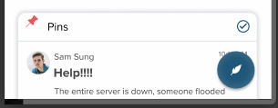

### INFO 365 - Mobile Application Design

**Course Objective** - To create a new design language and design system for a conceptual mobile OS, and use them to create high fidelity wireframes for system apps like the Camera app, Messages app, Browser app and many others.

We were required to strictly adhere to a design language and system (a baseline requirement
when designing for any product), and giving scrutiny to every detail in our high fidelity wireframes.
We had to ensure that every pixel was aligned properly, and that every design decision
we made had merit in terms of usability or visual appeal.

## Design System Development

<LightboxImage
  images={[
    {
      title: "IMG_20181017_190924.jpg",
      caption: "Developing our Design System Photo",
    }
  ]}
/>

For this project, our team started by developing an idea for a mobile operating system
that would built around foldable devices. Foldable devices at this point were just
starting to come out, with the Royale FlexPai dropping at the end of October 2018,
and other companies like Apple and Microsoft filing patents for some foldable device
hinge components. We we wanted to explore the design opportunities that could be
opened when a device was foldable, and how the OS would adapt and take advantage
of the changing form factor. We developed a design system for this mobile OS, and
iterated through a number of design sprints as to what our final design system would be.

Our resulting design system is shown in the gallery below, exemplifying the clean and minimal ethos that we were aiming for.

<LightboxImage
  images={[
    {
      title: "Pear_OS_Test_Screens.png",
      caption: "Design System Example Screens",
    },
    {
      title: "Pear_OS.png",
      caption: "Design System Colors and Fonts"
    }
  ]}
/>

## App Wireframing

We then created high fidelity mock-up screens with the Figma interface design tool for
**3 key system applications** for Pear OS over the course of 6 weeks, resulting in the
app screens that you see below. Throughout these **6 weeks, we iterated over this
design cycle every 2 weeks** for each app:

1. **Competitive Analysis**: performed research on existing conventions, popular applications similar to the one we were designing, and consulted our design system to get an idea what our design should look like. E.g. for our mail application, when we looked at mobile apps like Inbox, Gmail, Outlook, and Spark and many others to draw inspiration from and to assess the features that we needed to include in our own mail application
2. **Wireframing**: We then created low-fidelity wireframes and reviewed our designs with one another, our peers, and our professor to ensure that our user flow was information architecture was sound
3. **High Quality Mock Ups**: made improvements to these mock-ups based on stakeholder feedback, creating high-fidelity mock-ups for our designs and making adjustments down to the last pixel to ensure a professional design that could be presented to stakeholders (in our case, the judges that would be grading our designs).

## Scoring Results

3 screens for each of the 3 apps we wireframed were then scored by our professor and
2 of his peers in the app design industry. These scores were based on the screens user
experience design, aesthetics, professionalism (Every pixel in the design was accounted
for, if something was off center or 1 pixel too far to one side, points would be docked),
and adherence to style guides. The apps that we wireframed all got exceptional scores of 4.5/5 by each of the three scorers.

## **My Responsibilities**

I personally was in charge of multiple aspects of the designs, from the information
architecture of the app to user interface and user experience of the app designs.
I was also a key motivator in ensuring that the app designs we came up with would
adhere to our design system, assessing any interactions and design choices that
might clash with the design system we previously created.

*We unfortunately had to reduce the amount of wireframes we would create due to time
 constraints, abandoning the tablet-like wireframes we had created for when the device
  was unfolded, only pursuing high fidelity wireframes with the mobile phone experience*

<LightboxImage
  direction={"column"}
  columns={1}
  images={[
    {
      title: "Mail-App.png",
      caption: "Mail App High Fidelity Mockup"
    },
    {
      title: "News-App.png",
      caption: "News App High Fidelity Mockup"
    },
    {
      title: "Browser-App.png",
      caption: "Browser App High Fidelity Mockup"
    }
  ]}
/>

---

## Reflection

From this project, I learned how to

1. Create professional looking mobile designs

    Every pixel was accounted for; anything off center or a few pixels off would mean points deducted. Design choices were put under scrutiny for all elements on the screen.

2. Create, use, and adhere to style guides, and when it is appropriate break these rules

An example of this in action is when we were designing the “Compose” Button for our email application. This floating button broke away from our design system, but we made the choice of keeping this button this way, as it saved a significant amount of screen real estate, and is also a conventional type of interaction that already exists in other popular email apps like Outlook and Gmail. We were hesitant on implementing the design at first, and were only assured in our choice to implement this design after conferring with our professor about the convention and utility of this button design.

3. Collaborate on design choices for the applications

I think that the most unfortunate aspect of this project was that we were not able to pursue the foldable design aspects of the OS that we created, and explore the types of design opportunities that would be available when a device was foldable.

It would have made the designs more exploratory and experimental, but unfortunately was not possible within the scope of the class, as the goal of the class was to provide us with the design chops and skills to create professional-looking mobile app designs. Hopefully I will have the opportunity in the future to explore this new space in mobile design.

Here's a sneak peak of some of the mockups of our Email application we envisioned in the devices' unfolded tablet form factor:

<LightboxImage
  images={[
    {
      title: "Tablet_view_-_EXPERIMENTAL.png",
      caption: "Tablet View Experimental Mockup"
    },
    {
      title: "Tablet_view_-_menu_expended.png",
      caption: "Tablet View Menu Expanded Experimental Mockup"
    }
  ]}
/>
