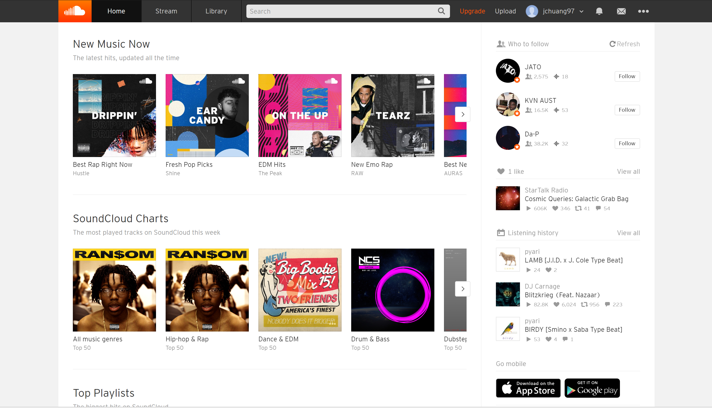
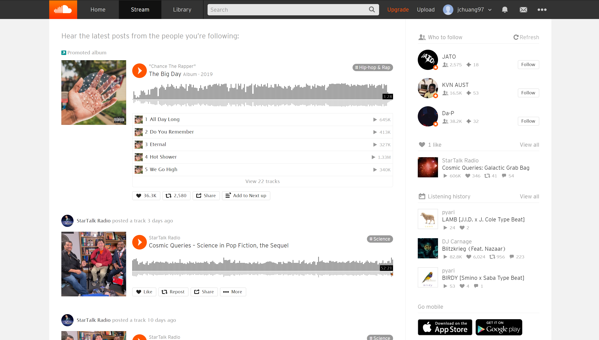
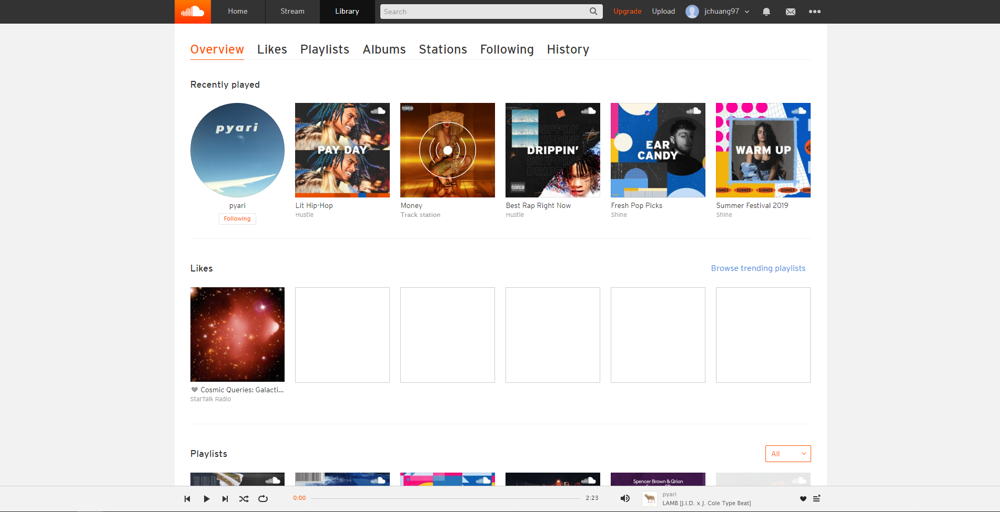
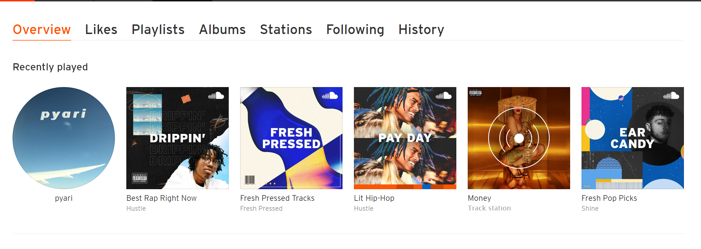
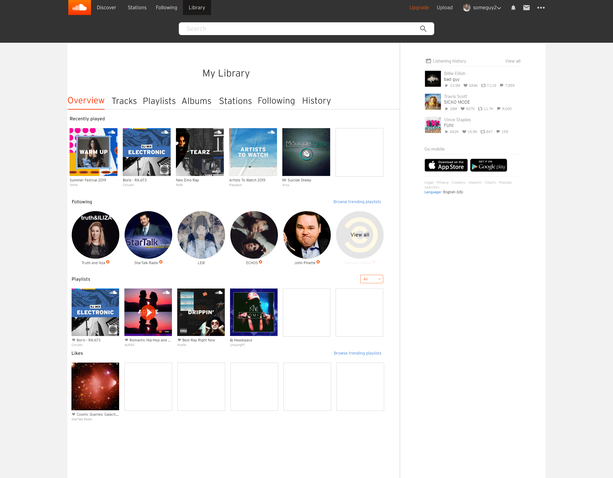

INFO 331 - Information Architecture | Course Project

SoundCloud, one of the world's most popular music streaming platforms, has accrued main stream media fame with up-and-coming artists launching their professional careers on the platform with a number of viral hits.

These hits are really a result of the great listener/creator dichotomy SoundCloud possesses on their platform. Listeners can discover new music and artists unique to the platform whilst also being able to listen to the typical popular and mainstream content populated on other music streaming platforms.  For creators, SoundCloud has opened up a whole new avenue for amateur, aspiring artists to easily upload, share, and promote their music on a large platform, and show people what they got.

Unfortunately this novel approach to drive content consumption and creation is paired with a design that could be vastly improved.  Although visual design issues are few and far between, the inconsistent information architecture that forms the backbone of SoundCloud's user experience is a detriment to an otherwise stellar platform.

# Job Well Done

## A Solid Bottom Up Architecture

That being said, SoundCloud does have a solid foundation in terms of its IA, with a comprehensive bottom-up architecture that allows user to easily understand and establish connections between their content, enabling them to explore and navigate the content easily.

Fundamentally, a bottom up architecture strives for "every page to be page one". In SoundCloud's case, each type of content (track/album/playlist/etc.) that SoundCloud has displays its own unique page that functions independently. For each type of content, you can see how the page's contents follow a specific pattern.

### 1. Song/Track Page

Each track page has a unique waveform display, allowing users to comment on timestamps. There is also a unique description provided under this waveform and comment system.

### 2. Album/Playlist Page

Each playlist or album page includes information like the number of tracks, the total time, and a unique tracklist.

For both these pages, you can see bits of information like the album art, the genre tag, and the recommendations section that remain identical on the page, only changing depending on content being displayed. These pages share the same type of information, and SoundCloud ensures that this information shows up exactly the same way, even if the content on the page is different.

SoundCloud also ensures that any piece of information a page displays that can be connected to another piece of content is linked. For example if you click on the artist name in the page above, you will be taken to the SoundCloud page for that artist. This interconnection applies to many other pieces of information on a page, like an individual track, an artist (in a number of contexts, like in a playlist) and a tag, among others.

## A Solid Top-Down Architecture

Top down architecture starts at a website's primary navigation, and SoundCloud's primary navigation is well designed, built for understanding, and driven by user needs.

### Global Navigation

1. A Home page gives users instant access to all of the trending content on SoundCloud, as well as other discovery focused, personalized content like "Artists you should know", "Future Sounds", "New Arrivals", and many more.

2. A Stream page gives users access to all of the content that they are following, allowing them to keep track of any new releases from their favorite artists on SoundCloud.

3. A Library page gives users instant access to any content that they have saved/liked, including tracks, albums, and playlists among many others.

These 3 pages all exemplify SoundCloud's understanding of their user's needs. Using a music discovery page as their homepage puts the unique value of SoundCloud's platform at the forefront of their user experience. In contrast, the Stream and Library pages put the focus on content users are already familiar with, with each enabling the user to explore this content in a different way. These pages compliment one another, putting focus on two critical needs for music listeners; the ability to discover new music and the ability to listen to music they already enjoy in a personalized setting.

### Local Navigation

There is only one instance of local navigation on the SoundCloud website, and this instance is naturally found in the Library page. The content that users can choose to save to their library like tracks, playlists and albums require distinctions that allow users to quickly find what they are looking for, and the local navigation on the page performs this exact function. SoundCloud even provides an Overview page in a user's library, consisting of carousels of content that was most recently played or liked by the user.

---

# Needs Improvement

### Labeling

SoundCloud makes good choices in terms of the pages they choose to show in their navigations, but they make some strange and misleading choices in terms of their labeling.

One example of this poor labeling is on their website's global navigation; the Stream tab.

This label choice seems poor as it is too vague, and gives little indication as to what kind of content a user should be expecting on that page; the Stream page actually consists of musical content from a user's followed artists. The label "Stream" might be helpful if that was the only place on their website to listen to music and consume content, but that is not the case. Regardless, one should be able to assume that they can stream ****music anywhere on a music **streaming** platform.

Instead, some more suitable choices could be "My Artists" or "My Follows", anything that can serve as a starting point for users to establish the connection between the label and the actual content on the page.

Another example of poor labeling is shown here at the local navigation of the Library page.

Specifically, SoundCloud chose to label the second tab as "Likes". This label is not inaccurate, but it is too broad. This page only contains **tracks** that a user may have liked, but other content such as albums and playlists can also be liked by a user.

## **Summary**

All in all, SoundCloud’s IA is robust and well-designed, despite a few shortcomings. It has a good understanding of its user base and the structure of their IA is aligned with this understanding. With a few improvements, users can feel more confident about finding the content they want quickly and easily. We took some time to showcase some of the improvements we made into a short prototype that can be found [here](https://xd.adobe.com/view/e31902e5-d73f-4ba2-4f43-ade2e29e27f9-9528/?fullscreen).

